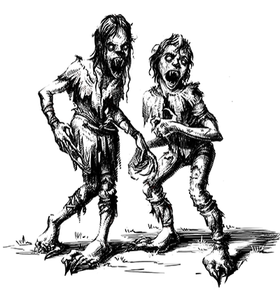
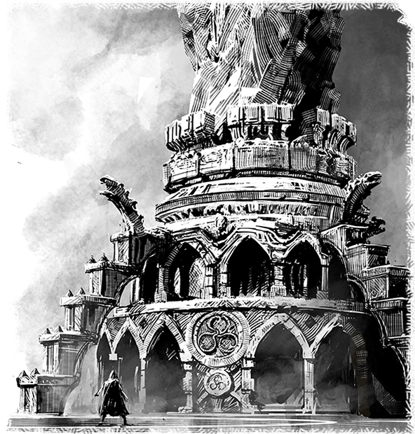
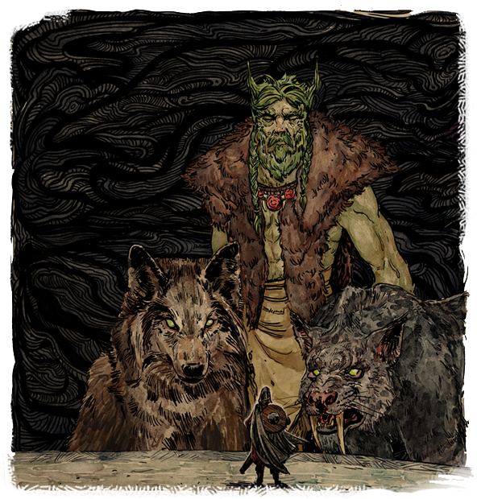
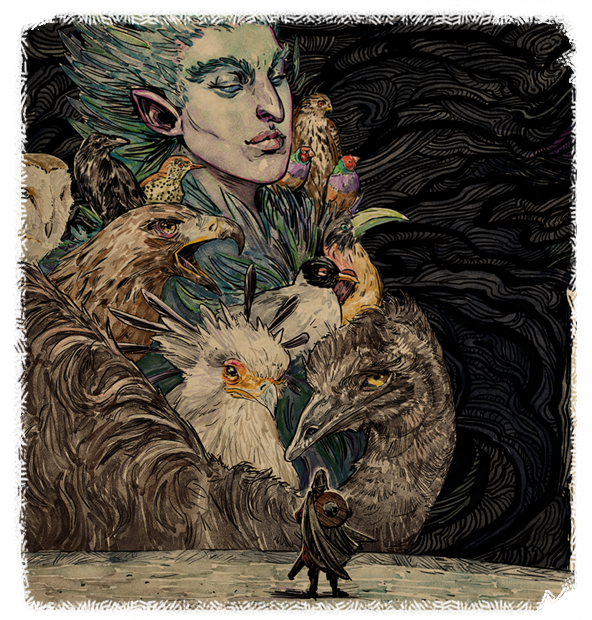
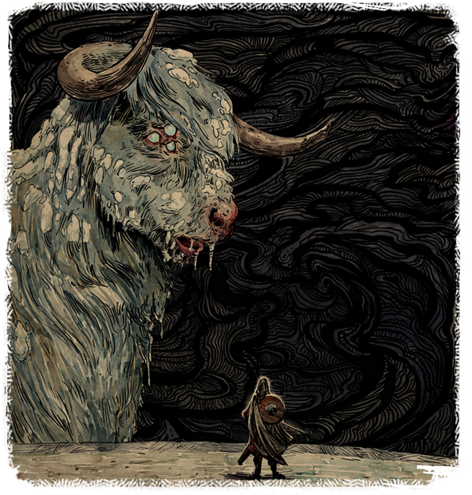
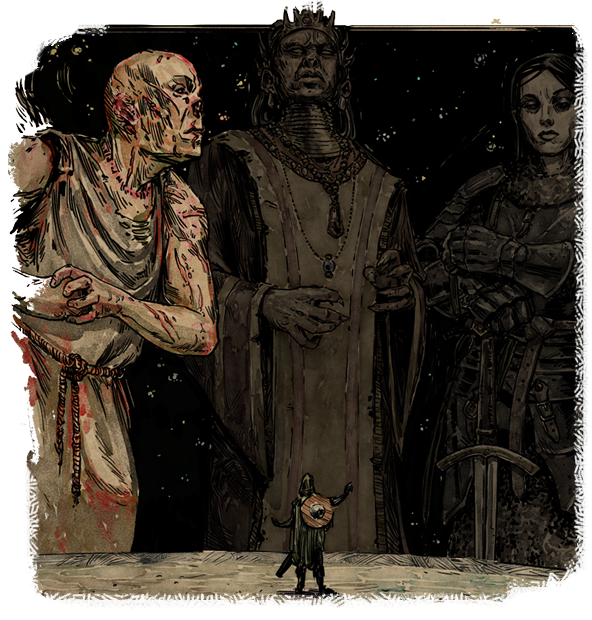

# More Background Information
by: Spherikal

### Table of Contents
1. [The Hollowborn Crisis](#the-hollowborn-crisis)
   * [The Fate of the Souls](#the-fate-of-the-souls)
   * [My Pledge to the Gods](#my-pledge-to-the-gods)
   * [The fate of Thaos ix Arkannon's Souls](#the-fate-of-thaos-ix-arkannons-souls)
   * [Maerwald's Fate](#example2)
   * [Establish My Stance at the Animancy Trial](#example2)
   * [Defiance Bay Faction Support](#example2)
2. [Companions](#third-example)
   * [The Fate of the Souls](#the-fate-of-the-souls)
3. [The White March](#third-example)
4. [The Gilded Vale and Raedric's Hold](#third-example)
5. [The Endless Paths of Od Nua](#third-example)
6. [Defiance Bay](#third-example)
7. [Twin Elms](#third-example)

## The Hollowborn Crisis

**In 2823 AI**, the influence of Waidwen's Legacy and the resulting waves of refugees stretched Dyrwood to the breaking point. Fifteen years of hollowing denied the Free Palatinate an entire generation of laborers, soldiers, artists, and thinkers, leaving only desolation in its wake.

Responding to great sociopolitical pressure to try and help the Hollowborn, animancers developed a process to transplant animal souls into the infants, that they might develop survival instincts and even a basic personality. The process seemed successful, so it was repeated on tens of thousands of Hollowborn. The process was named "Salvation" and the Hollowborn given souls this way were called the "Saved."

Five years after the first Hollowborn - an orlan girl - was saved, she entered puberty. In a matter of mere weeks, she transformed into a ravenous, feral creature devoid of all conscience. Soon, all of the Saved would experience the same fate. Each one, upon reaching puberty, would transform into what the locals called ‘Wichts’ (uncontrollable children).

***

**"Which events of the Hollowborn Crisis do you wish to establish?**
- [The Fate of the Souls](#example)
   * [I returned the souls to their intended bodies](#example)
   * [I sent the souls back to the Wheel](#example)
   * [I disintegrated the Souls](#example)
   * [I distributed the soul essence to the Dyrwood](#example)
   * [I devoted the souls to Woedica](#example)
   * [I dispersed the souls randomly](#example)
- [My Pledge to the Gods](#my-pledge-to-the-gods)
   * [Berath](#example)
   * [Hylea](#example)
   * [Galawain](#example)
   * [Rymrgand](#example)
   * [I pledged to two Gods](#example)
   * [I pledged to three Gods](#example)
   * [All of them](#example)
   * [None of them](#example)
- [The fate of Thaos ix Arkannon's Souls](#the-fate-of-thaos-ix-arkannons-souls)
   * [I returned his soul to the Wheel](#example)
   * [I destroyed his souls](#example)
   * [I banished his soul to Beith Eaman for all eternity](#example)
   * [I erased his memories](#example)
- [Maerwald's Fate](#example2)
   * [I released his soul to the Wheel](#example)
   * [I bound his soul to Caed Nua as a warden](#example)
   * [I absorbed his soul for his knowledge](#example)
- [Establish My Stance at the Animancy Trial](#example2)
   * [Animancy should continue in the Dyrwood](#example)
   * [Anymancy should be outlawed in the Dyrwood](#example)
- [Defiance Bay Faction Support](#example2)
   * [I supported the Crucible Knights](#example)
   * [I supported the Dozens](#example)
   * [I supported the Doemenels](#example)
   * [None - I made enemies of all of them](#example)

---

### The Fate of the Souls

You come out in the room you are standing in now, but it is new and pristine and filled with people - thousands of them, all turned towards the great adra pillar and the machine that encases it.

Thaos stands at the machine, and you are one with him now. You look out at the crowd, at faces of shriveled old men and cherub-cheeked little girls, at mothers bouncing infants to quiet them and fathers clasping their children's restless hands and watching you with somber acceptance. A woman with tears in her eyes gives you a small nod.

You turn back toward the machine, your breaths constricted beneath the weight of unwanted knowledge, preparing yourself to set out alone on a journey without end. You close your eyes and open them again to find the machine still in front of you, beckoning.

You take your place in front of it and place your hands upon a large mechanical disc at the base of the great crystal column and speak a single word. Giant rings creak to life, building speed, setting arrays of carved draconic mouths aglow and sending tremors through the platform beneath you.

The entire room shakes now with the force of the accelerating machine, all sound drowned out by its deep, deafening thrum. Brilliant tendrils of light arc outward from the pillar in all directions, and you look over your shoulder to see them engulfing the crowd, burning them brightly like hot iron.

One by one, the tendrils disappear, leaving ashen effigies where people once stood, many of them disintegrating into gray heaps under the stress of the tremors.

You look above to the adra pillar, and a glowing spherical mass has begun to coalesce atop the column where the arcs converge. It grows and pulses, translucent and bulbous like some immense chrysalis, suspended in slow rotation as though it were being spun from the arcs of light.

When the last arc disappears, the spectral mass hangs a moment, no longer rotating, so bright you must shield your eyes with an outstretched hand, and it seems to you as though it is looking at you.

You bow your head in acknowledgment, and look back up to see it melt into the pillar like warm candle wax. The pillar flares with a flash of light bright as the sun itself, then fades to darkness.

The machine slows down to an abrupt halt, and when the last echo of its grinding cogs has passed, the chamber is still, and you are alone.

### "What happened to the souls?"

#### I returned the souls to their intended bodies (Hylea's choice)

At your direction, the souls diverted by Thaos were guided back to the vessels originally meant for them. For the first time, parents of Hollowborn children woke to the cries of their infants, and looked into their eyes to see them staring back. People fell to their knees where they stood, thanking Hylea or Magran, or even Eothas for their forgiveness of whatever guilt they felt they bore.
    
But for all the relief that had come to some parents, others only found new grief, for many thousands of Hollowborn had died during Waidwen's Legacy, many by their parents' own hands. For those children there would be no homecoming.
    
Yet the last Hollow birth was in the past now, and those parents willing to risk trying for a new child were frequently rewarded, often with twins. Many felt they saw Hylea's hand in it, and the year would be remembered as the Year of Hylea's Splendor.

#### I sent the souls back to the Wheel (Berath's choice)

At your direction, the lost souls of the Hollowborn were funneled back into the churn of Berath's Wheel, to find their way into new vessels and partake in the life they had been denied during Waidwen's Legacy.
    
Though parents of Hollowborn would remain just that, the end of Waiwen's Legacy would bring about a spate of new, healthy births, with many of the infants bearing souls once meant for Hollowborn children. The natural cycle of life and death had been restored to Dyrwood, and with it came a renewed faith in the providence of the gods.

#### I disintegrated the Souls (Rymrgand's choice)

At your direction, the thousands of souls gathered at the machine in Sun in Shadow were disintegrated, their essence scattered to the winds like a lifting fog, never again to find its way into the body of a living being.

Though none in Dyrwood would ever know for certain what had become of the missing souls, many followers of the Beast of Winter were given visions of a mass exodus to a land of eternal peace. Solemn celebrations were held the following day among his faithful.
    
The last Hollow birth in Dyrwood was already in the past, and a new peace of mind had come not just to the lost souls of the Hollowborn, but to all the people of Dyrwood.

#### I distributed the soul essence to the Dyrwood (Galawain's choice)

At your direction, the essence gathered in Sun in Shadow was sent across Dyrwood to meld with and galvanize the souls of its people. In the days that followed, Dyrwoodans confronting adversity and expecting to be at the mercy of their own weakness instead found strength and the will to persevere. The aggrieved found themselves able to carry on after their losses. The desperate found new reasons to live.
    
And the new reasons to hope were many, for Waidwen's Legacy had come to an end after fifteen years. Hollow births ceased in Dyrwood and a country that only days ago had seemed on the brink of collapse was suddenly on the path to a recovery - a fitter, more resilient country in the preferred image of the god of the hunt.

#### I devoted the souls to Woedica (Skaen's choice)
    
At your direction, the goddess Woedica ultimately received the empowerment she had sought, albeit not in the manner she had expected. The swirling souls held captive in Sun in Shadow were swept into the great adra pillar there, sent barreling down through the world's veins to places unknown to mortal sight.

Though no word would reach your ears of their arrival, by the time you had returned to Twin Elms, word had spread of a miracle on their Burial Isle, and pious Glanfathans were already streaming in from all over to observe the statue of Woedica there, its once-broken crown now fully restored.

But for Dyrwood itself, the last Hollow birth had come and gone, and the country celebrated the lifting of Waidwen's Legacy none the wiser as to what future costs its end might hold.
    
#### I dispersed the souls randomly (Wael's choice)

At your direction, the souls of the Hollowborn, long lost to the people of Dyrwood, were sent to a place or places unknown for reasons as mysterious as the god who suggested it. No sooner had the mystery of their whereabouts been solved than it was renewed - a new riddle for someone yet to be revealed, or perhaps for no one at all.
        
For the people of Dyrwood, the question would linger as it always had, for even the truth was beyond belief. One day the Hollow births had stopped with as little explanation as they had started. For all their joy at the Legacy's end, Dyrwoodans would have to content themselves with their own theories as to the how and why of it all. But perhaps this was as Wael intended.

### My Pledge to the Gods

The delemgan of Elms' Reach, told the Watcher that Thaos has destroyed the route from Teir Evron to Breith Eaman. To reach him, they will have to descend through the pit in the Burial Isle. The gods are willing to offer great power in exchange for a promise to deal with the stolen souls in the manner of their choosing. There would, however, be a price for betrayal.

Deity | Promise
--- | ---
Galawain | Distribute essence to existing souls in Dyrwood to strengthen them.
Hylea | Return souls to the bodies they were intended for.
Berath | Send souls back into the reincarnation cycle.
Rymrgand | Entropically disintegrate the souls, ending their existence.

#####  Galawain goes on the hunt

###### Renege on your agreement with Galawain

It is said that Galawain is the enforcer of the gods, and is known to hunt down those who wrong them. To wrong Galawain, then, is truly to wake the beast, and the Father of Monsters took great umbrage at your broken promise to him. Along with Magran and Abydon, Galawain embarked upon a more direct approach to claiming his quarry.

In the months that followed, the frontier settlements of Dyrwood were inexplicably attacked by packs of beasts and monsters, suddenly organised and unafraid to approach kith on their own land. Many such villages were all but destroyed by the time troops could be dispatched from local garrisons.

Those that weren't destroyed by the beasts of Galawain often found themselves at the mercy of the fires of Magran. A dry spell throughout Dyrwood led to a rash of forest fires on a scale not seen since the War of Black Trees, and many settlements paid the price for their proximity to the wilderness.

In the cities, meanwhile, dabblers in animancy who had placed the souls into golems and other moving vessels soon found that their creations had risen up against them. Such constructs terrorised their surroundings, killing indiscriminately and often in great numbers before being subdued.

***

#####  Hylea is infuriated, makes a trade with Berath to scourge Dyrwood

###### Renege on your agreement with Hylea

Hylea, who had expected the souls to be returned to the Hollowborn, was infuriated by your duplicity. The goddess of motherhood demanded new births in compensation, and made a bargain with Berath to trade death for new life.

The skies of Dyrwood darkened, blotted with swarms of birds and other winged creatures called together to claim what the Sky-mother believed to be hers by right. For months, the people of Dyrwood were forced to stay under shelter for fear of the vicious, unexplained attacks from the sky. The incidents left entire villages decimated and littered the streets of Defiance Bay with corpses covered in a thousand puncture wounds.

***

#####   Berath evens the score with an epidemic of deaths

###### Renege on your agreement with Berath

Followers of Berath have a saying that life is a debt all must pay in death, and their god is known to always collect what is owed. In breaking your word to Berath, a debt was created - souls were owed to the Cycle - and the agents of the god of inevitability would not be refused.

An epidemic of unexplained deaths struck Dyrwood in the days that followed the Legacy. Most often the dead would be travelers on the road, known to be a favorite target of Bareth's Pallid Knight, who exacts impossible tolls from those who have journeyed for too long. The elderly, too, seemed to pass on in alarming numbers. But just as often the deaths appeared to strike randomly and for no reason at all.

Those who sensed the involvement of the Twinned God dubbed the calamity "Berath's Price," supposing it a payment for the end of Waidwen's Legacy.

***

#####  Rymrgand and Ondra take their due anyway

###### Renege on your agreement with Rymrgand

The loss of the souls you had promised to entropy would be no setback to Rymrgand, nor to Ondra, for the Beast of Winter trudges ever forward, and the will of the Lady of Lament is as unstoppable as the tide. In Dyrwood, the weather quickly chilled. Unseasonable frosts destroyed the year's harvests before giving way to the coldest winter in memory. Many who survived the famine would soon freeze to death in their own homes.

The oceans proved no safer. A barrage of squalls pounded the harbors along the Dyrwoodan coast for months, sending many ships to be forever lost in the depths of Ondra's domain, either mourned or forgotten- both to the Lady's liking.

***

#####   Skaen sends the effigy as vengeance

###### Renege on your agreement with Skaen

Skaen did not take lightly the insult of being lied to about the destination of the souls of the Hollowborn. Feeling that an act of defiance was warranted against all of Dyrwood for daring to reclaim its souls from his queen, Skaen wasted no time in compelling his followers to summon an incarnation of the Effigy into the world to take revenge, something that had not happened for more than a century, and never at the god's own request.

In the heart of the bustling city of New Heomar, Skaenites maimed and disfigured one of their own number, removing eyes, hair, nose, and genitals, carving the body bloody and replacing its eyes with black stones. The chosen vessel was given blood to drink - not of a noble, as the ritual ordinarily called for - but a dozen ordinary Drywoodans. The incarnation of the Effigy born into that body was as brutal as any in recorded history, tirelessly slaying hundreds and ritualistically maiming their bodies before falling dead, satisfied.
